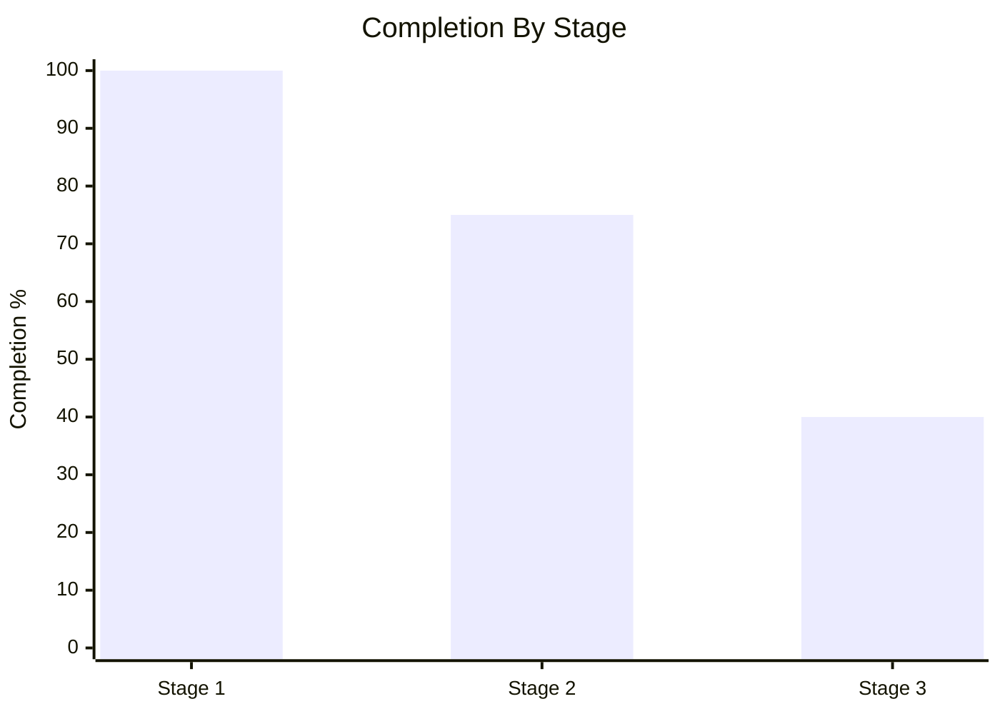
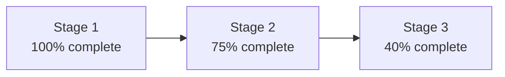
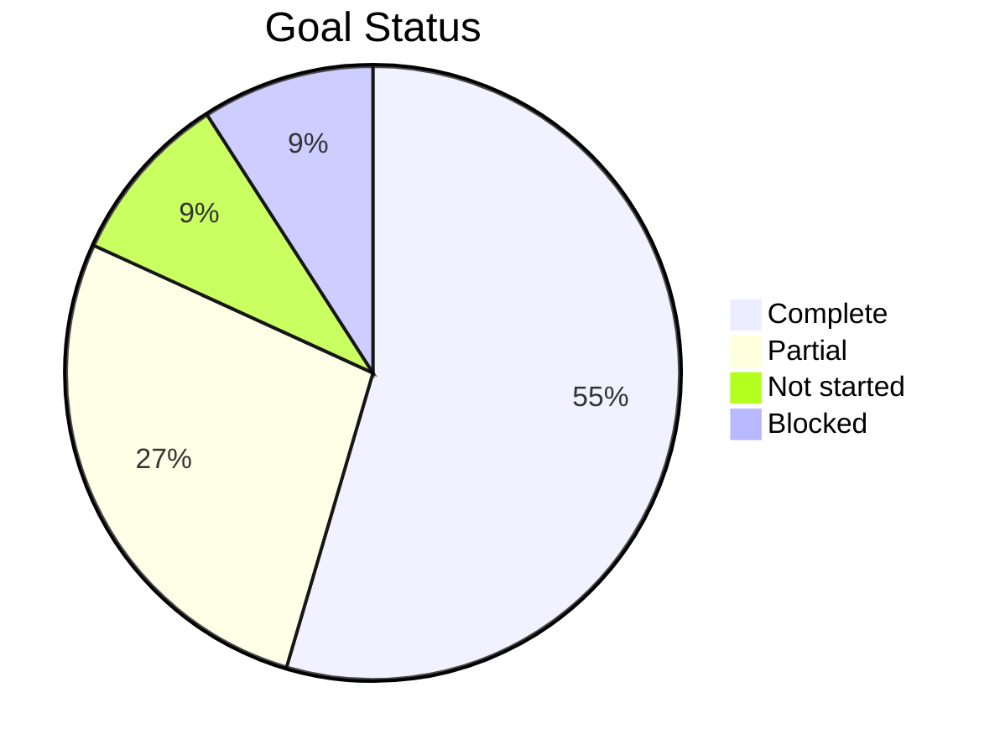

# Plan Report Template

Use this template when producing a plan implementation result report. Keep the
table and chart orientation unless the user explicitly asks for a different
format.

## Required Report Structure

````markdown
# <Plan Name> Implementation Result Report

- Report date: <YYYY-MM-DD>
- Source plan: <path, issue, request, or reconstructed>
- Scope inspected: <repo, branch, commit, deployment, docs, or artifact set>
- Verification summary: <commands, checks, reviews, or blockers>

## 1. Completion Overview

| Level | Planned Units | Verified Units | Completion | Scoring Basis |
|---|---:|---:|---:|---|
| Overall | ... | ... | ...% | ... |
| Stage: ... | ... | ... | ...% | ... |



## 2. Stage And Module Completion

| Stage | Stage Completion | Module | Module Completion | Status | Evidence | Verification |
|---|---:|---|---:|---|---|---|
| ... | ...% | ... | ...% | complete / partial / not started / blocked / deferred / removed from scope / not verified | ... | ... |

## 3. Goal Alignment Matrix

| Main Goal | Subgoal | Planned Result | Work Actually Done | Measured Effect | Verification Method | Status |
|---|---|---|---|---|---|---|
| ... | ... | ... | ... | ... | ... | complete / partial / not started / blocked / deferred / removed from scope / not verified |

## 4. Engineering Benefit Matrix

| Main Goal | Engineering Benefit | Benefit Type | Baseline | Target | Observed Result | Verification Evidence | Status |
|---|---|---|---|---|---|---|---|
| ... | concrete engineering benefit, not generic value wording | performance / reliability / delivery speed / maintainability / testability / observability / security-compliance | ... | ... | measured value, not verified, or not applicable with reason | command, test, metric, log, review, or artifact | achieved / partial / not verified / not achieved |

## 5. Evidence And Verification Matrix

| Item | Evidence Type | Evidence Location | Verification Performed | Result | Gap |
|---|---|---|---|---|---|
| ... | code / test / runtime / doc / review | path, command, log, artifact, or link | ... | passed / failed / not run / blocked | ... |

## 6. Unfinished Work

| Unfinished Item | Planned Scope | Current State | Reason Not Completed | Evidence For Reason | Impact If Left Unfinished | Required Decision |
|---|---|---|---|---|---|---|
| ... | ... | ... | specific, factual reason | ... | ... | finish / defer / remove scope / redesign / blocked by external dependency |

## 7. Recommended Next Actions

| Priority | Action | Rationale | Dependency | Expected Outcome | Verification |
|---:|---|---|---|---|---|
| P0 / P1 / P2 | ... | ... | ... | ... | ... |
````

## Optional Charts

Use Mermaid when a visual summary will make the report easier to scan.

### Stage Flow Status



### Goal Coverage



## Forbidden Completion Phrases

Do not use these phrases or close equivalents:

| Forbidden Phrase | Replace With |
|---|---|
| basically complete | exact percentage plus remaining item |
| main path complete | implemented scope and missing edge cases |
| mostly done | complete, partial, or not verified |
| no major gaps | explicit gap list or `no unfinished items found from inspected scope` |
| almost finished | exact remaining acceptance criteria |
| largely complete | exact percentage and evidence |
| 基本完成 | 明确百分比、已完成项、未完成项 |
| 主线完成 | 明确已验证路径和未验证路径 |
| 没有大的缺口 | 明确缺口清单，或说明在已检查范围内未发现未完成项 |

## Engineering Benefit Quality Bar

Every main goal needs at least one concrete engineering benefit row.

| Weak Benefit | Acceptable Benefit |
|---|---|
| Improved maintainability. | Split report scoring from output formatting; module responsibility is now isolated and future scoring changes touch one file instead of three. |
| Better performance. | Build time decreased from 8m10s to 5m40s in CI run `<id>`, a 31% reduction against the plan target of 25%. |
| More reliable. | Added retry reason logging and regression coverage for timeout failures; verification command `<command>` now fails on missing reason fields. |
| Easier to operate. | Release rollback now has a documented command and smoke check; operator manual steps decreased from 7 to 3. |

## Unfinished Reason Quality Bar

An unfinished reason is acceptable only when it is concrete and falsifiable.

| Weak Reason | Acceptable Reason |
|---|---|
| Time was limited. | No migration rollback test was run before the reporting date, so the data migration stage cannot be verified. |
| Needs polish. | The UI state exists, but empty-state copy and keyboard navigation acceptance criteria were not implemented. |
| Waiting on backend. | The frontend integration remains blocked because the `/api/report-status` endpoint is not available in staging. |
| Low priority. | The plan explicitly deferred CSV export to Phase 3; Phase 3 has not started, so export remains 0% complete. |
